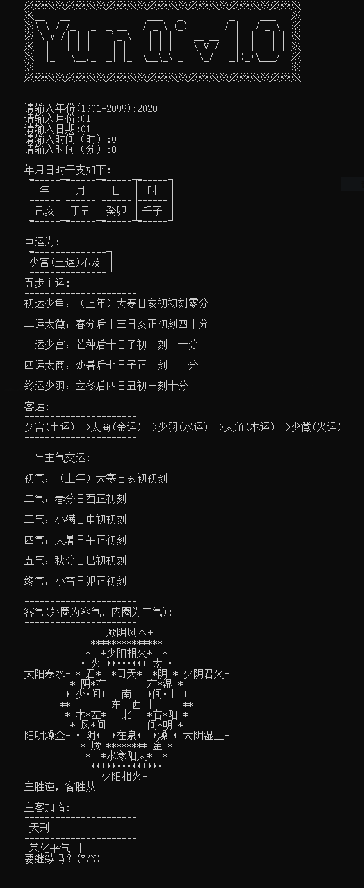

# five_circuits_six_qi
五运六气（theory of five circuits six qi in traditional Chinese medicine (TCM) ）

- 很久以前写的一个关于五运六气的查询软件
- 程序填写公历，农历转换部分来自于cuichao@gmail.com
- 编写规则依据来源于
```
ISBN  	7-5015-0175-0 : CNY3.70
题名  	运气学说的研究与考察 / 王琦等著
出版发行 北京 : 知识出版社, 1989.6
载体形态  353页 ; 19cm
个人著者  王琦等
```
- 运行样例如下




